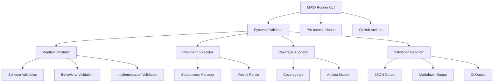

# MAID Runner Completion Roadmap

## Executive Summary

This document outlines the remaining tasks to complete the MAID Runner implementation, building upon the existing behavioral validation infrastructure (task-004) and following the insights from SYSTEMIC_VALIDATION_PLAN.md. Each task follows strict MAID methodology with manifest-driven development.

## Current State

### Completed Components ✅
- **Task-001**: Schema validation
- **Task-002**: AST-based implementation validation
- **Task-003**: Behavioral validation capability
- **Task-004**: Behavioral test integration (validates tests USE artifacts)

### Validation Layers Implemented
1. **Structural**: Manifest conforms to schema
2. **Behavioral**: Tests syntactically reference declared artifacts
3. **Implementation**: Code contains declared artifacts

## Required Components for Completion

---

## Task-005: Systemic Validator

### Goal
Implement systemic validation that orchestrates validation across all manifests in chronological order, ensuring complete codebase integrity.

### Manifest: `task-005-systemic-validator.manifest.json`
```json
{
  "goal": "Implement systemic validator to orchestrate validation of entire manifest chain with chronological ordering and comprehensive reporting",
  "taskType": "create",
  "creatableFiles": ["validators/systemic_validator.py"],
  "readonlyFiles": [
    "validators/manifest_validator.py",
    "validate_manifest.py",
    "tests/test_task_005_systemic_validator.py"
  ],
  "expectedArtifacts": {
    "file": "validators/systemic_validator.py",
    "contains": [
      {
        "type": "class",
        "name": "SystemicValidator",
        "methods": [
          {"name": "__init__", "parameters": [{"name": "manifest_dir"}]},
          {"name": "validate_all", "returns": "ValidationReport"},
          {"name": "validate_manifest_chain", "parameters": [{"name": "manifests"}]},
          {"name": "check_chronological_ordering"},
          {"name": "validate_superseding_chain"}
        ]
      },
      {
        "type": "class",
        "name": "ValidationReport"
      },
      {
        "type": "function",
        "name": "main"
      }
    ]
  },
  "validationCommand": ["pytest tests/test_task_005_systemic_validator.py -v"]
}
```

### Behavioral Tests: `tests/test_task_005_systemic_validator.py`
```python
def test_validates_all_manifests_in_order():
    """Test that all manifests are validated in chronological order"""

def test_detects_missing_task_numbers():
    """Test detection of gaps in task numbering"""

def test_validates_superseding_chains():
    """Test that superseding references are valid"""

def test_generates_validation_report():
    """Test comprehensive report generation"""

def test_cli_interface():
    """Test command-line interface for systemic validation"""
```

### Implementation Requirements
- Load all manifests from `manifests/` directory
- Sort by task number (handle task-001 through task-999+)
- Track superseding relationships
- Validate each manifest using existing validators
- Generate comprehensive report

---

## Task-006: Command Executor

### Goal
Implement actual execution of validation commands with subprocess management, timeout handling, and result parsing.

### Manifest: `task-006-command-executor.manifest.json`
```json
{
  "goal": "Implement command executor to run validation commands with proper error handling, timeout management, and result parsing",
  "taskType": "create",
  "creatableFiles": ["validators/command_executor.py"],
  "readonlyFiles": [
    "tests/test_task_006_command_executor.py"
  ],
  "expectedArtifacts": {
    "file": "validators/command_executor.py",
    "contains": [
      {
        "type": "class",
        "name": "CommandExecutor"
      },
      {
        "type": "class",
        "name": "CommandResult",
        "attributes": [
          {"name": "returncode"},
          {"name": "stdout"},
          {"name": "stderr"},
          {"name": "duration"},
          {"name": "timed_out"}
        ]
      },
      {
        "type": "function",
        "name": "execute_command",
        "parameters": [
          {"name": "command"},
          {"name": "timeout"},
          {"name": "cwd"}
        ],
        "returns": "CommandResult"
      },
      {
        "type": "function",
        "name": "parse_pytest_output",
        "parameters": [{"name": "output"}],
        "returns": "TestResults"
      }
    ]
  },
  "validationCommand": ["pytest tests/test_task_006_command_executor.py -v"]
}
```

### Behavioral Tests
```python
def test_executes_simple_command():
    """Test basic command execution"""

def test_handles_command_timeout():
    """Test timeout handling"""

def test_captures_stdout_and_stderr():
    """Test output capture"""

def test_parses_pytest_success_output():
    """Test parsing of successful pytest runs"""

def test_parses_pytest_failure_output():
    """Test parsing of failed pytest runs"""
```

---

## Task-007: Coverage Analyzer

### Goal
Implement coverage analysis to verify that tests actually execute the code paths for declared artifacts, not just syntactically reference them.

### Manifest: `task-007-coverage-analyzer.manifest.json`
```json
{
  "goal": "Implement coverage analyzer using coverage.py to verify tests execute declared artifact code paths",
  "taskType": "create",
  "creatableFiles": ["validators/coverage_analyzer.py"],
  "readonlyFiles": [
    "tests/test_task_007_coverage_analyzer.py"
  ],
  "expectedArtifacts": {
    "file": "validators/coverage_analyzer.py",
    "contains": [
      {
        "type": "class",
        "name": "CoverageAnalyzer"
      },
      {
        "type": "function",
        "name": "analyze_test_coverage",
        "parameters": [
          {"name": "test_command"},
          {"name": "target_file"},
          {"name": "expected_artifacts"}
        ],
        "returns": "CoverageReport"
      },
      {
        "type": "class",
        "name": "CoverageReport",
        "attributes": [
          {"name": "covered_artifacts"},
          {"name": "uncovered_artifacts"},
          {"name": "coverage_percentage"}
        ]
      }
    ]
  },
  "validationCommand": ["pytest tests/test_task_007_coverage_analyzer.py -v"]
}
```

### Behavioral Tests
```python
def test_measures_function_coverage():
    """Test that function execution is tracked"""

def test_measures_class_instantiation_coverage():
    """Test that class usage is tracked"""

def test_detects_uncovered_artifacts():
    """Test detection of unused code paths"""

def test_integrates_with_pytest_cov():
    """Test pytest-cov integration"""
```

### Implementation Requirements
- Use `coverage.py` or `pytest-cov`
- Map coverage data to declared artifacts
- Identify which artifacts are actually executed
- Generate coverage report for manifest validation

---

## Task-008: Validation Reporter

### Goal
Implement comprehensive reporting system with multiple output formats (JSON, Markdown, CI-friendly).

### Manifest: `task-008-validation-reporter.manifest.json`
```json
{
  "goal": "Implement validation reporter with JSON, Markdown, and CI output formats for comprehensive validation results",
  "taskType": "create",
  "creatableFiles": ["validators/validation_reporter.py"],
  "readonlyFiles": [
    "tests/test_task_008_validation_reporter.py"
  ],
  "expectedArtifacts": {
    "file": "validators/validation_reporter.py",
    "contains": [
      {
        "type": "class",
        "name": "ValidationReporter"
      },
      {
        "type": "function",
        "name": "generate_json_report",
        "parameters": [{"name": "results"}],
        "returns": "str"
      },
      {
        "type": "function",
        "name": "generate_markdown_report",
        "parameters": [{"name": "results"}],
        "returns": "str"
      },
      {
        "type": "function",
        "name": "generate_ci_report",
        "parameters": [{"name": "results"}],
        "returns": "str"
      }
    ]
  },
  "validationCommand": ["pytest tests/test_task_008_validation_reporter.py -v"]
}
```

---

## Task-009: CI/CD Integration

### Goal
Implement pre-commit hooks and GitHub Actions integration for automated validation.

### Manifest: `task-009-ci-integration.manifest.json`
```json
{
  "goal": "Create CI/CD integration with pre-commit hooks and GitHub Actions for automated MAID validation",
  "taskType": "create",
  "creatableFiles": [
    ".pre-commit-config.yaml",
    ".github/workflows/maid-validation.yml"
  ],
  "readonlyFiles": [
    "tests/test_task_009_ci_integration.py"
  ],
  "expectedArtifacts": {
    "file": ".github/workflows/maid-validation.yml",
    "contains": [
      {"type": "attribute", "name": "name"},
      {"type": "attribute", "name": "on"},
      {"type": "attribute", "name": "jobs"}
    ]
  },
  "validationCommand": ["pytest tests/test_task_009_ci_integration.py -v"]
}
```

---

## Task-010: MAID Runner CLI

### Goal
Create unified CLI interface for all MAID operations.

### Manifest: `task-010-maid-runner-cli.manifest.json`
```json
{
  "goal": "Implement comprehensive CLI for MAID runner with commands for validation, reporting, and development workflow",
  "taskType": "create",
  "creatableFiles": ["maid_runner.py"],
  "readonlyFiles": [
    "validators/systemic_validator.py",
    "validators/command_executor.py",
    "validators/coverage_analyzer.py",
    "validators/validation_reporter.py",
    "tests/test_task_010_maid_runner_cli.py"
  ],
  "expectedArtifacts": {
    "file": "maid_runner.py",
    "contains": [
      {
        "type": "function",
        "name": "main"
      },
      {
        "type": "function",
        "name": "validate_command",
        "parameters": [{"name": "args"}]
      },
      {
        "type": "function",
        "name": "report_command",
        "parameters": [{"name": "args"}]
      },
      {
        "type": "function",
        "name": "develop_command",
        "parameters": [{"name": "args"}]
      }
    ]
  },
  "validationCommand": ["pytest tests/test_task_010_maid_runner_cli.py -v"]
}
```

### CLI Commands
```bash
# Validate single manifest
maid-runner validate manifests/task-001.manifest.json

# Validate all manifests
maid-runner validate --all

# Generate report
maid-runner report --format markdown --output report.md

# Development mode (agent workflow)
maid-runner develop manifests/task-011.manifest.json

# Check coverage
maid-runner coverage manifests/task-001.manifest.json
```

---

## Integration Timeline

### Phase 1: Core Infrastructure (Week 1)
- [ ] Task-005: Systemic Validator
- [ ] Task-006: Command Executor

### Phase 2: Analysis Tools (Week 2)
- [ ] Task-007: Coverage Analyzer
- [ ] Task-008: Validation Reporter

### Phase 3: Automation (Week 3)
- [ ] Task-009: CI/CD Integration
- [ ] Task-010: MAID Runner CLI

### Phase 4: Testing & Documentation (Week 4)
- [ ] End-to-end testing
- [ ] Documentation updates
- [ ] Example projects

---

## Success Criteria

### Functional Requirements
✓ All manifests validate successfully
✓ Validation commands execute with proper error handling
✓ Coverage analysis identifies untested code
✓ Reports generated in multiple formats
✓ CI/CD pipeline operational

### Performance Requirements
✓ Full validation suite < 30 seconds
✓ Individual manifest validation < 5 seconds
✓ Parallel execution where possible

### Quality Requirements
✓ 100% test coverage for validator code
✓ All tasks self-validate
✓ Clear error messages and debugging info

---

## Architecture Diagram



---

## Risk Mitigation

### Risk: Performance Impact
**Mitigation**: Implement caching and parallel validation

### Risk: Breaking Changes
**Mitigation**: Comprehensive test suite before each task

### Risk: Complex Dependencies
**Mitigation**: Clear interfaces between components

---

## Next Immediate Steps

1. **Review and approve this roadmap**
2. **Create feature branch**: `maid-runner-completion`
3. **Begin with Task-005**: Systemic Validator
4. **Follow strict MAID workflow** for each task

---

*This roadmap ensures the MAID Runner becomes a complete, production-ready system for manifest-driven development with comprehensive validation at every level.*