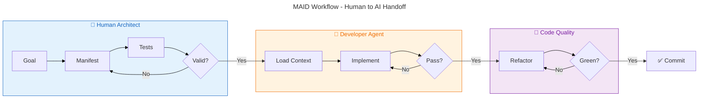

### **MAID: The Manifest-driven AI Development Methodology**

**Version:** 1.3
**Date:** October 30, 2025

#### **Abstract**

The Manifest-driven AI Development (MAID) methodology is a structured approach to software engineering that leverages AI agents for code implementation while ensuring architectural integrity, quality, and maintainability. It addresses the core challenge of AI code generation—its tendency to produce plausible but flawed code without architectural awareness—by shifting the developer's role from a direct implementer to a high-level architect who provides AI agents with perfectly isolated, testable, and explicit tasks. This is achieved through a workflow centered on a Task Manifest, a declarative file that defines a self-contained unit of work as part of a verifiable sequence. By combining this manifest with architectural patterns that promote extreme decoupling, MAID creates a predictable and scalable environment for AI-assisted development.

-----

#### **Core Principles**

The MAID methodology is founded on five core principles:

  * **Explicitness over Implicitness:** An AI agent's context must be explicitly defined. The agent should never have to guess which files to edit, what dependencies exist, or how to validate its work.
  * **Extreme Isolation:** A task given to an AI agent should be as isolated as possible from the wider codebase *at the time of its creation*. The goal is to create a temporary "micro-environment" for every task, minimizing the cognitive load on the LLM.
  * **Test-Driven Validation:** The sole measure of an AI's success is its ability to make a predefined set of tests pass. The **manifest is the primary contract**; tests support implementation and verify behavior against that contract.
  * **Directed Dependency:** The software architecture must enforce a one-way flow of dependencies from volatile details (frameworks, databases) inward to stable business logic, as defined by Clean Architecture. This protects the core logic and simplifies tasks for the AI.
  * **Verifiable Chronology:** The current state of any module must be the verifiable result of applying its entire sequence of historical manifests. This ensures that the codebase has a transparent and reproducible history, preventing undocumented changes or "code drift."

-----

#### **The MAID Workflow**



The development process is broken down into distinct phases, characterized by two main loops: a **Planning Loop** for the human architect and an **Implementation Loop** for the AI agent.

1.  **Phase 1: Goal Definition (Human Architect)**
    The human developer defines a high-level feature or bug fix. For example: "The system needs an endpoint to retrieve a user's profile by their ID."

2.  **Phase 2: The Planning Loop (Human Architect & Validator Tool)**
    This is an iterative, local phase where the plan is perfected before being committed. The process is as follows:
    * **Draft the Contract:** The architect first drafts the **manifest**. The manifest is the primary contract that defines the task's goal, scope, and expected structural artifacts.
    * **Draft the Behavioral Tests:** The architect then drafts the **behavioral test suite**, which supports the manifest by defining the success criteria.
    * **Structural Validation & Refinement:** The architect uses a validator tool (e.g., maid-runner) to repeatedly check for alignment. This Structural Validation is comprehensive:
        * It validates the draft manifest against the behavioral test code (using AST analysis) to ensure the plan is internally consistent.
        * If the task involves editing an existing file, it also validates the current implementation code against its entire manifest history (using the Merging Validator) to ensure the starting point is valid.
    * The architect refines both the manifest and the tests together until this validation passes and the plan is deemed complete.
    * After the user approves the plan, the architect ends the planning loop by running `maid plan lock <manifest-path>`. The lock seals the approved manifest and its behavioral test files before implementation handoff.

3.  **Phase 3: Implementation (Developer Agent)**
    Once the plan is finalized and committed, an automated system invokes a "Developer Agent" with the manifest. The agent's **Implementation Loop** is as follows:
    * Read the manifest to load only the specified files into its context.
    * Write or modify the code based on the `goal` and its understanding of the tests.
    * The controlling script executes the `validationCommand` from the manifest.
    * If this **Behavioral Validation** fails, the error output is fed back into the agent's context for the next iteration. This loop continues until all tests pass.
    * The implementation handoff gate runs `maid verify --require-plan-lock --require-red-evidence` to require the sealed plan and valid red-phase evidence for the manifest under review.

4.  **Phase 4: Integration**
    Once the task is complete, the newly implemented code and its corresponding manifest are committed. Because the work was performed against a strict, test-verified manifest contract, it can be integrated with high confidence.

##### **Plan Locks and Red-Phase Evidence**

`maid plan lock <manifest-path>` creates a tamper-evident lock file under
`.maid/plan-locks/<manifest-slug>.lock.json`. The lock records content hashes
for the approved manifest and its behavioral test files, the creation
timestamp, revision metadata, and red-phase evidence captured from the
manifest's `validate:` commands.

New locks store the manifest pin as a contract-scoped hash with the
`sha256-contract:` prefix: the runner parses the manifest YAML, removes only
the top-level `outcome` key, and hashes the canonical JSON serialization of
the remainder (`json.dumps` with `sort_keys=True` and stable separators).
YAML-native dates and datetimes normalize to ISO-format strings before
canonicalization, and non-string mapping keys normalize to the same string
form JSON uses. Quoted and unquoted ISO dates therefore hash identically. Any
other non-JSON-native value fails loud with the manifest path and offending
location; there is still no byte-hash fallback.
`maid plan status` and legacy-lock contract checks dispatch on the stored
prefix — `sha256:` still compares raw file bytes for legacy manifest pins —
so existing locks stay valid without migration. Because the contract hash pins
parsed data, YAML comment or formatting-only edits no longer flip status under
the new format; every parsed key except `outcome` still participates, so real
contract edits remain tamper-evident. Lock and revise fail loud on unreadable
manifests rather than falling back to byte hashing. Status is reporting-oriented:
an unreadable manifest returns exit 1 with `manifest_match: false` and
`manifest_error` in JSON, with an equivalent `Manifest error` line in text.

Behavioral test files use versioned prefix dispatch. New locks hash `.py`
behavioral tests with `sha256-pyast:v2:` over a compact canonical AST payload.
The payload preserves node names, ordered non-empty fields, and type-tagged
literal values while omitting only absent and empty-list fields. Strings are
encoded as the hexadecimal form of their exact UTF-8 `surrogatepass` bytes, so
lone or paired surrogate escapes cannot collide with actual astral code points.
This keeps whitespace- and comment-only edits (including Black reformats)
hash-neutral and avoids false E701 tampering when supported CPython versions
add empty AST fields. Historical `sha256-pyast:` v1 entries continue to compare
through the original
`ast.dump(..., annotate_fields=True, include_attributes=False)` rule,
and non-Python or older test entries retain byte `sha256:` comparison. Existing
locks are never rewritten automatically; v1 remains tied to its historical
interpreter shape until an intentional plan revision writes v2. Assertion,
import, string-literal, and other AST-visible edits remain tamper-evident under
both AST formats, and parse/decode/canonicalization failures remain fail-loud.

Red-phase evidence uses exit-code-only classification. For pytest commands,
exit 1 is valid red because tests ran and failed, exits 2/3/4/5 are invalid
because they represent usage, internal, interruption, or collection failures,
and exit 0 means the tests already pass and are not red. MAID stores the final
output tail for human inspection, but it does not parse text output to decide
whether evidence is red. `maid plan lock --no-run` records
`red_evidence: null`.

Completed manifests that predate plan-lock adoption have a separate migration
path: `maid plan lock <manifest-path> --legacy-baseline --reason "<text>"`.
The manifest must be tracked and already present at Git HEAD. The command
rejects every dirty path except the manifest, requires identical declared
artifacts and file sections relative to HEAD, permits behavioral-test discovery
only to grow, and requires every prior validate argv to remain exact, gain only
appended behavioral-test paths discovered from the current command set, or be
preserved exactly under `acceptance.tests` for an audited validate-to-acceptance
cleanup. Acceptance-preserved commands are not run while capturing the green
baseline; they remain explicit opt-in evidence outside default `maid test` and
`maid verify` gates. Suffix extension is refused when the committed argv ends in
an option token, because the path could be consumed as that option's value.
Overlapping command prefixes are matched one-to-one, and additional validate
commands are allowed. It then runs every current command and requires a green
exit code of zero.
Manifest and behavioral-test hashes are compared before and after execution,
and unrelated generated or modified paths also fail the migration.

After evidence capture, the new lock is published with exclusive filesystem
semantics. A destination that appears during validation or publication is never
overwritten or deleted. MAID removes only its own private temporary file; a
malformed destination remains visible and blocks retry, while a structurally
valid competing lock is likewise preserved for explicit operator review.

The resulting lock keeps `red_evidence: null` and stores an independent
`legacy_baseline` record containing the required reason, baseline commit and
manifest hash, contract delta, bounded green command results, and capture time.
A structurally valid, command-snapshot-bound legacy baseline satisfies
`--require-red-evidence` as an explicit brownfield exception. New or untracked
manifests, ordinary `--no-run` locks, non-green commands, contract changes,
mutated contract files, and malformed or command-mismatched legacy records
continue to fail E704 or E705. A later plan revision does not carry the legacy
baseline forward; new behavioral work requires a new manifest and genuine red
evidence.

Intentional plan changes use
`maid plan revise <manifest-path> --reason "<text>"`. The reason is required
and the revision re-baselines the manifest and behavioral test hashes. Use
`maid plan status <manifest-path>` to inspect lock state, hash matches and
mismatches, and red evidence in text or JSON form.

When implementation review changes the behavioral contract after implementation
is already present, use `maid plan revise <manifest-path> --reason "<text>"
--stash-implementation`. This is a targeted recovery workflow: MAID stashes
only declared non-test implementation paths, including narrow wiring paths
declared under `files.read` when the manifest also declares a contracted
writable implementation path, leaves the revised manifest and behavioral tests
in the worktree, captures fresh red evidence, restores the implementation
changes, and saves the revised lock only when the evidence is valid red.
`files.read` behavioral test paths are never stashed, and undeclared dirty paths
are still refused; declaring a touched wiring file under `files.read` is the
bounded way to include it in the targeted stash for contracted implementation
plans. Scope-only manifests still reject separate dirty `files.read` context
paths. It refuses missing Git metadata, unrelated dirty paths, staged target
changes, missing target implementation changes, and conflicting `--no-run` or
`--preserve-red-evidence` modes.

In a legitimate multi-manifest session,
`--stash-implementation --allow-sibling-dirty` may tolerate dirty paths outside
the revised manifest's exact declared surface. Those paths are not stashed or
modified: their full sorted list is echoed and stored in the evidence payload
as `sibling_dirty_paths` for audit. Without the flag, the fail-closed refusal
remains and points to either `files.read` for narrow wiring context or the
opt-in flag for sibling work. The boundary is exact declared paths; MAID does
not infer whether undeclared coupling could influence validation.

Untracked declared `files.create` paths are targeted and restored
byte-identically. Intent-to-add paths fail with a `git reset -- <paths>`
recovery command, while staged targets remain refused with an exact
`git restore --staged <paths>` command. If a green capture targets
`package.json`, `package-lock.json`, `bun.lock`, `yarn.lock`, `pnpm-lock.yaml`,
`uv.lock`, `poetry.lock`, `Cargo.lock`, or `go.sum`, MAID reports the bounded
dependency limitation: materialized state such as `node_modules`, `.venv`, or
`vendor` is not stashed. Temporarily install the prior dependency state and use
plain revise, or record a reasoned legacy baseline; MAID does not rebuild or
stash dependency trees.

For metadata-only corrections after implementation has already made the
behavioral tests pass, use `maid plan revise <manifest-path> --reason "<text>"
--preserve-red-evidence`. This preserves the existing valid red evidence while
updating the manifest and behavioral test hashes. The option is rejected unless
the existing lock already has valid red evidence or internally valid
`test_only_green` evidence, and it cannot be combined with `--no-run`. It does
not bypass E707: changing validate command strings while
preserving old evidence remains detectable by the locked `validate_commands`
snapshot.

For test-only contracts whose entire writable surface is test files (no
implementation to stash), use `maid plan revise <manifest-path> --reason "<text>"
--test-only-green`. Capture refuses unless every writable path
(create/edit/delete/snapshot/scope) classifies as a test file via
`is_test_file`, and unless every validate command currently passes. The lock
records honest green evidence tagged `mode: test_only_green`. Enforcement
accepts that payload for `--require-red-evidence` only while the persisted
`_manifest_contract` writable set remains entirely test files; if a later
revision adds an implementation file, or the contract snapshot is missing, the
evidence immediately fails E705 with a mode/contract mismatch detail. E707
command cross-checks still apply. The flag is mutually exclusive with
`--stash-implementation`, `--preserve-red-evidence`, and `--no-run`.
`maid plan lock` does not accept `--test-only-green`; initial lock still
requires a genuine red phase.

Plain contract-preserving revise also carries valid `test_only_green` evidence
forward when the contract delta is empty, locked behavioral test bytes still
match with no newly discovered test files, and every current writable path
still classifies as a test file. The classifier bound is rechecked on each
revision so a later classifier change fails closed and requires recapture. The
preservation notice names whether red or test-only-green evidence was carried.

PostgreSQL manifests can run file-backed pgTAP tests without duplicating shell
exit-code adapters:

```bash
maid pgtap -- -f supabase/tests/example.test.sql
```

The adapter runs `psql` with a clean startup and forced `ON_ERROR_STOP=1`.
Successful SQL exits 0. A psql script exit 3 becomes MAID's behavioral-red exit
1 only when stdout contains an anchored pgTAP `not ok N -` line or stderr
contains an exact `psql:<file>:<line>: ERROR: pgTAP failures:` final-guard
line. Missing files, connection or permission failures, unrelated SQL errors,
spawn failures, and marker-like text quoted inside another error return exit 2
and remain invalid red evidence. A `-f`/`--file` target is required; standard
short-option clusters such as `-qftests/example.test.sql` are accepted, and
callers cannot override `ON_ERROR_STOP`. Original stdout and stderr are
preserved for the plan lock's bounded evidence tail.

Plan-lock enforcement is opt-in. `maid verify --require-plan-lock
--require-red-evidence` scopes requirement errors to the task window: E700
PLAN_LOCK_MISSING, E704 RED_PHASE_EVIDENCE_MISSING, and E705
RED_PHASE_EVIDENCE_INVALID apply to active manifests whose manifest file
changed in the verify run. E704 also applies when an in-scope manifest has no plan lock
under `--require-red-evidence`. Integrity errors apply regardless of task window
scope: E701 BEHAVIORAL_TEST_MODIFIED_AFTER_LOCK and E702 MANIFEST_CONTRACT_WEAKENED_AFTER_LOCK apply to every locked active manifest,
E703 PLAN_LOCK_STALE applies when a lock references a missing manifest,
E706 PLAN_LOCK_UNREADABLE applies when a lock file exists but is corrupt,
unreadable, or malformed, and E707 RED_EVIDENCE_COMMAND_MISMATCH applies when
a lock's red-phase evidence command strings do not match the `validate_commands`
snapshot recorded in the lock's manifest contract. E702 applies when declared
artifacts or behavioral test entries shrink relative to the locked manifest;
additive manifest changes are legal.
E708 PLAN_LOCK_SCOPE_WIDENED is a warning reporting that enforcement widened beyond the task window.
This is deliberate fail-closed behavior after changed-scope baseline resolution:
E708 reports this widening without changing which manifests are enforced, and
callers should reconcile the named manifests or pass an explicit baseline when
the wider scope was not intended.

E707 binds red-phase evidence to the validate commands that produced it.
Sanctioned flows (`maid plan lock`, `maid plan revise`, and the promote
migration) snapshot the manifest's validate command strings into the lock's
`_manifest_contract.validate_commands` at save time, so honest locks are
self-consistent. A lock whose `red_evidence` command multiset differs from
that snapshot is spliced or hand-edited evidence and fails closed. The
comparison targets the snapshot, not the current manifest: post-lock additive
validate edits remain legal, and contract shrinkage stays E702's job. Locks
created before the snapshot field existed skip the check until their next
sanctioned re-save, and locks with `red_evidence: null` are owned by E704
instead.

##### **Constraint Evidence Gates**

`maid verify --artifact-coverage` and `maid validate --artifact-coverage` are
opt-in Python-only runtime evidence gates. They run the manifest's pytest-based
`validate:` commands under coverage.py, load the JSON coverage report, map each
declared public Python function or method artifact to its body line range, and
fail with `E710 ARTIFACT_NOT_EXECUTED_BY_TESTS` when no body line of that
artifact executes. Class artifacts pass when any declared method on the class
executes. Attribute artifacts are excluded from this gate. The coverage support
lives in the optional quality extra; install `maid-runner[quality]`. Requesting
artifact coverage without the extra fails closed with `E307` semantics naming
the missing validator dependency.

`maid verify --knockout` is an opt-in Python-only gate that rewrites one
declared public function or method artifact at a time to
`raise NotImplementedError("maid-knockout")`, runs the manifest's validate
commands, and restores the original source content from an in-memory copy with
hash verification. If all validate commands still exit 0 while the artifact is
knocked out, MAID reports `E711 ARTIFACT_KNOCKOUT_NOT_DETECTED`. Harness
failures such as parse errors, command spawn failures, or restore anomalies
report `E712 KNOCKOUT_HARNESS_FAILURE` and include the named file so callers
can recover the worktree state. Knockouts run sequentially in manifest
declaration order; `--knockout-limit` bounds the artifact count, and
`--knockout-allow-dirty` permits dirty target files for workflows that
explicitly accept that risk. Knockout is not full mutation testing; it proves
this single failure mode and does not promise broader mutmut-style mutation
coverage.

The changed-scope baseline that defines the task window resolves from
`--since <commit>`, `--base-ref <ref>` (merge-base with HEAD), or
`metadata.maid_task_base`. Because `maid_task_base` is a current-task
declaration, metadata baselines are sourced only from active manifests whose
own manifest file has uncommitted worktree changes — the manifests of the
task in flight. Committed historical declarations are ignored, so completed
tasks that declared different bases cannot poison bare resolution.
Conflicting values among the considered worktree-changed manifests still
fail closed with E116 CHANGED_SCOPE_BASELINE_INVALID, and when git state
cannot be read every active manifest is considered: degraded environments
only make resolution stricter. With no flags and no considered declaration,
resolution raises E115 CHANGED_SCOPE_BASELINE_REQUIRED, which the plan-lock
gate maps to the worktree changed-files fallback: on a clean tree the
plan-lock stage passes with an empty task window while integrity errors
still apply.

-----

#### **Core Components & Patterns**

  * **The Task Manifest**
    The Task Manifest is a JSON file that makes every task explicit and self-contained. It serves as an immutable record of a single change, forming one link in a chronological chain that defines the state of a module. The schema supports detailed interface definitions and multiple validation commands.

    **Enhanced Format Support:** The schema now supports both legacy and enhanced formats for backward compatibility:
    - **Legacy format:** `validationCommand` (single array), `parameters` field
    - **Enhanced format:** `validationCommands` (array of arrays for multiple commands), `args` field, `metadata` object, enhanced `returns` format, `raises` field

    Both formats are fully supported and can coexist. New manifests can use the enhanced format while existing manifests continue to work unchanged.

    **Example (Enhanced Format):**
    ```json
    {
      "version": "1",
      "goal": "Refactor the UserService to add a method for finding a user by ID.",
      "taskType": "edit",
      "supersedes": [],
      "editableFiles": ["src/services/user_service.py"],
      "readonlyFiles": [
        "tests/test_user_service.py",
        "src/models/user.py"
      ],
      "metadata": {
        "author": "developer@example.com",
        "tags": ["refactoring", "user-service"],
        "priority": "high"
      },
      "expectedArtifacts": {
        "file": "src/services/user_service.py",  // ⚠️ OBJECT with "file" + "contains" (NOT an array!)
        "contains": [
          {
            "type": "class",
            "name": "UserService",
            "bases": ["BaseService"]
          },
          {
            "type": "function",
            "name": "get_user_by_id",
            "class": "UserService",
            "args": [{"name": "user_id", "type": "int"}],
            "returns": {"type": "User"},
            "raises": ["ValueError"]
          }
        ]
      },
      "validationCommands": [
        ["pytest", "tests/test_user_service.py", "-v"],
        ["mypy", "src/services/user_service.py"]
      ]
    }
    ```

    **Example (Legacy Format - Still Supported):**
    ```json
    {
      "goal": "Add a method to UserService",
      "readonlyFiles": [],
      "expectedArtifacts": {
        "file": "src/services/user_service.py",  // ⚠️ OBJECT with "file" + "contains" (NOT an array!)
        "contains": [
          {
            "type": "function",
            "name": "get_user_by_id",
            "class": "UserService",
            "parameters": [{"name": "user_id"}],
            "returns": "User"
          }
        ]
      },
      "validationCommand": ["pytest", "tests/test_user_service.py"]
    }
    ```

    **⚠️ IMPORTANT: `expectedArtifacts` Structure**
    - `expectedArtifacts` is an **OBJECT**, not an array
    - It defines artifacts for **ONE file only** (specified by the `file` field)
    - For multi-file tasks: Create **separate manifests** for each file
    - The `systemArtifacts` field (array) is only for system-snapshot manifests

  * **Multi-Language Support**
    MAID Runner supports validation across multiple programming languages with production-ready parsers:

      * **Python** - Full support via Python AST (built-in)
        - File extensions: `.py`
        - Artifact types: `class`, `function`, `attribute`
        - Features: Type hints, async/await, decorators, class inheritance

      * **TypeScript/JavaScript** - Production-ready support via tree-sitter
        - File extensions: `.ts`, `.tsx`, `.js`, `.jsx`
        - Artifact types: `class`, `function`, `interface`, `type`, `enum`, `namespace`, `attribute`
        - Features: Generics, decorators, JSX/TSX, async functions, arrow functions
        - React support is TypeScript-backed: function components, typed const
          components, custom hooks, provider functions, props interfaces/types,
          common `memo`/`forwardRef` wrapper exports, Testing Library component
          references, lazy `import()` calls, path aliases, and local CSS module
          imports are validated through the TypeScript parser, import scanner,
          and identity matcher
        - React snapshot support tracks existing relative style and static asset
          imports as read boundaries; CSS, SVG, images, fonts, and media are not
          parsed as MAID artifacts
        - Angular support is TypeScript-backed: decorated classes, fields,
          methods, standalone imports, and lazy route `import()` calls are
          validated through the TypeScript parser and import scanner
        - Angular snapshot support tracks literal `templateUrl`, `styleUrl`,
          and `styleUrls` companion files as read boundaries when the files
          exist

    Angular support does not use Angular compiler analysis. Decorator names
    such as `Component`, `Injectable`, `Directive`, `Pipe`, `Input`, and
    `Output` are metadata, not public MAID artifacts. External templates and
    styles are tracked as files for review scope, but their contents are not
    parsed as Angular template or stylesheet artifacts.

    React support does not use React runtime, DOM, React Native, Next.js,
    Remix, Vite, webpack, or other bundler semantic analysis. JSX intrinsic
    tags, JSX attribute names, React imports, Testing Library helpers, CSS, and
    static assets are not public MAID implementation artifacts.

    The validator automatically detects the language based on file extension and routes to the appropriate parser. All validation features (behavioral tests, implementation validation, snapshot generation, test stub generation) work seamlessly across languages.

    **Supported Artifact Types:**
    - **Common (Python & TypeScript):** `class`, `function`, `attribute`
    - **TypeScript-Specific:** `interface`, `type`, `enum`, `namespace`

  * **Context-Aware Validation Modes**
    The structural validator operates in two modes based on the manifest's intent, providing a balance between strictness and flexibility:

      * **Strict Mode (for `creatableFiles`):** The implementation's public artifacts must *exactly match* `expectedArtifacts`. This prevents AI code pollution in new files.
      * **Permissive Mode (for `editableFiles`):** The implementation's public artifacts must *contain at least* `expectedArtifacts`. This allows for iterative changes to existing files.

  * **Prescribed Architectural Patterns**
    To enable the necessary isolation, projects following MAID must adhere to these patterns:

      * Hexagonal Architecture (Ports & Adapters)
      * Dependency Injection (DI)
      * Single Responsibility Principle (SRP)

-----

#### **Advanced Concepts & Future Techniques**

  * **Handling Code Evolution (Migrations, Refactoring & Snapshots)**
    This is a set of strategies to manage the manifest history over the project's lifecycle, ensuring the codebase remains verifiable.

    * **The Merging Validator:** Inspired by database migrations, this validator tool enforces the Verifiable Chronology principle. To validate a file, it finds all "active" manifests in its history, merges their `expectedArtifacts` into a single, comprehensive list, and performs a strict validation against the current state of the implementation code.

    * **Handling Refactoring with `supersedes`:** To handle breaking changes without violating immutability, a new manifest can formally supersede an old one. It uses the optional `supersedes` property (an array of manifest paths). The Merging Validator is smart enough to ignore any manifest that has been superseded, allowing the contract to evolve. Superseded manifests are considered "dead" for validation but remain as an immutable part of the project's audit log.

      **Important:** When a manifest is superseded, it is completely excluded from MAID operations:
      - The validator (`maid validate`) ignores superseded manifests when merging manifest chains
      - The test runner (`maid test`) does NOT execute `validationCommand` from superseded manifests
      - Superseded manifests serve as historical documentation only—they are archived, not active

    * **Refactoring Private Implementation (No Manifest Required):** MAID provides flexibility for refactoring private implementation details without requiring new manifests. If a change only modifies private code (functions, classes, or variables with `_` prefix) and doesn't introduce new public APIs or change existing public interfaces:

      **When No New Manifest Is Needed:**
      - The change only affects private implementation (no new public methods/classes)
      - The public API remains unchanged (no changes to public function signatures, class interfaces, or module exports)
      - Internal logic improvements, bug fixes, or code quality enhancements

      **Process:**
      1. **Do NOT create a new manifest**
      2. **Update the tests** of the existing latest manifest for the file being edited
      3. Add test cases to cover the new behavior, bug fix, or enhancement
      4. Ensure all existing tests continue to pass
      5. Run validation to confirm the existing manifest still validates correctly

      **Example:**
      - File `utils.py` has manifest `task-014-validation-command-utils.manifest.json`
      - You need to fix a bug in private function `_extract_from_list_command()` to support vitest test runners
      - **Action**: Update `tests/test_task_014_validation_command_utils.py` with vitest test cases
      - **Do NOT**: Create a new manifest like `task-151-support-vitest.manifest.json`

      This approach maintains the audit trail through test updates while avoiding unnecessary manifest proliferation for internal improvements. The existing manifest's tests serve as the documentation of the change.

    * **Consolidated Snapshots:** For mature modules with a long manifest history, a tool can be run to generate a single "snapshot" manifest. This new manifest describes the complete current state of the file and supersedes all previous manifests for that file. This is also the primary mechanism for onboarding existing, legacy code into the MAID methodology.

    * **Transitioning from Snapshots to Natural Evolution:** Snapshot manifests are designed for "frozen" code—capturing a complete baseline. Once code needs to evolve, you must transition to the natural MAID flow:

      **The Pattern:**
      1. **Snapshot Phase** (Initial state): A snapshot manifest captures the complete public API of a file at a specific point in time
         ```json
         {
           "taskType": "snapshot",
           "expectedArtifacts": {
             "file": "src/service.py",
             "contains": [
               {"type": "function", "name": "existing_func_1"},
               {"type": "function", "name": "existing_func_2"}
             ]
           }
         }
         ```

      2. **Transition Manifest** (First evolution): When the file needs to evolve, create an edit manifest that:
         - Declares ALL current functions (existing + new)
         - Supersedes the snapshot manifest
         - Uses `taskType: "edit"` (not "snapshot")

         ```json
         {
           "taskType": "edit",
           "supersedes": ["task-015-snapshot-service.manifest.json"],
           "expectedArtifacts": {
             "file": "src/service.py",
             "contains": [
               {"type": "function", "name": "existing_func_1"},
               {"type": "function", "name": "existing_func_2"},
               {"type": "function", "name": "new_func"}  // New addition
             ]
           }
         }
         ```

      3. **Future Evolution** (Natural MAID flow): Subsequent manifests only declare new changes:
         ```json
         {
           "taskType": "edit",
           "expectedArtifacts": {
             "file": "src/service.py",
             "contains": [
               {"type": "function", "name": "another_new_func"}  // Only the new addition
             ]
           }
         }
         ```

         With `--use-manifest-chain`, the validator merges all active manifests, so the complete API is validated without needing to update previous manifests.

      **Why This Pattern Works:**
      - Snapshot = baseline for static/legacy code
      - Transition manifest = bridge from frozen state to natural evolution
      - Natural flow = incremental changes leveraging manifest chaining
      - Future manifests can add APIs without touching previous manifests

      **Key Rule:** Once you supersede a snapshot with a comprehensive edit manifest, continue using incremental edit manifests. Don't create new snapshots unless establishing a new "checkpoint" baseline.

  * **File Deletion Pattern**

    When removing a file that was previously tracked by MAID:

    1. **Create a deletion manifest** with `taskType: "refactor"`
    2. **Supersede** the original creation manifest
    3. **Delete** the file, its tests, and any imports
    4. **Validate** the deletion with behavioral tests

    Use status: "absent" in expectedArtifacts to mark the file as deleted.

    **Manifest Structure:**
    ```json
    {
      "goal": "Remove module X as it is no longer needed",
      "taskType": "refactor",
      "supersedes": ["manifests/task-XXX-create-module.manifest.json"],
      "creatableFiles": [],
      "editableFiles": [],
      "expectedArtifacts": {
        "file": "module_x.py",
        "status": "absent",
        "contains": []
      },
      "validationCommand": ["pytest", "tests/test_verify_deletion.py", "-v"]
    }
    ```

    **Validation Requirements:**
    - File no longer exists
    - Test file for original feature is deleted
    - No remaining imports from the deleted module

    **Audit Trail:** The superseded manifest preserves the complete history of when and why the file was created and later removed.

  * **File Rename Pattern**

    When renaming a file tracked by MAID:

    1. **Create a rename manifest** with `taskType: "refactor"`
    2. **Supersede** the original creation manifest
    3. **Use `git mv`** to preserve file history
    4. **Update** manifest to reference new filename
    5. **Validate** the rename with behavioral tests

    **Manifest Structure:**
    ```json
    {
      "goal": "Rename module_old.py to module_new.py for clarity",
      "taskType": "refactor",
      "supersedes": ["manifests/task-XXX-create-module-old.manifest.json"],
      "creatableFiles": ["path/to/module_new.py"],
      "expectedArtifacts": {
        "file": "path/to/module_new.py",
        "contains": [
          {"type": "function", "name": "existing_function"}
        ]
      },
      "validationCommand": ["pytest", "tests/test_verify_rename.py", "-v"]
    }
    ```

    **Validation Requirements:**
    - Old filename no longer exists
    - New filename exists with correct functionality
    - No remaining imports from old module name
    - Git history preserved via `git mv`

    **Key Difference from Deletion:** The `creatableFiles` contains the new filename, and `expectedArtifacts` declares the same public API under the new file location. This maintains continuity of the module's functionality while updating its location.

  * **The "Scaffold and Fill" Pattern**
    A stricter version of the workflow where the Architect Agent not only creates tests but also creates the `editableFiles` with empty function signatures. This reduces the Developer Agent's task to pure implementation.

  * **IDE Integration (The "Guardian Watcher")**
    The structural validator can be integrated into an IDE (e.g., as a VS Code extension). It runs in the background like a linter, providing real-time feedback to the architect during the "Planning Loop" and catching alignment errors the moment they are made.

  * **The Guardian Agent and Self-Healing Codebases**
    For ongoing maintenance, a top-level "Guardian Agent" can run the entire test suite after any change is committed. If a change breaks tests, the Guardian can automatically generate a new manifest to dispatch a fix.

  * **Codebase as a Dependency Graph**
    By analyzing `import` statements, the entire codebase can be mapped as a Directed Acyclic Graph (DAG). This allows the system to automatically identify all necessary `readonlyFiles` for a given task and run tasks in parallel.
